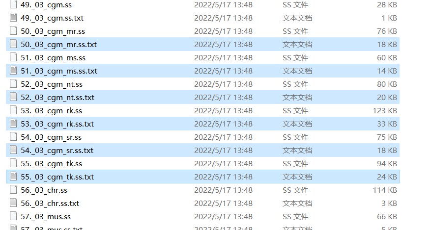

# ToneWorks_CG_Merge

Python scripts for merging the CGs extracted from the games of tone work's

这个项目是用来合并tone work's社的游戏中的CG的，目前支持：初恋1/1、星织梦未来（仅Perfect Edition）、银色遥远、在月之彼岸邂逅（含SSR）  
This project is used to merge the CGs extracted from the games of tone work's， currently support：初恋1/1, 星織ユメミライ(Perfect Edition only), 銀色、遥か、月の彼方で逢いましょう(including SSR)

**注意，此脚本不包含解包功能，请先完成解包后再进行合成**  
**Caution: this script does not include the unpack function, please unpack the CGs first**

由于游戏中解包出的画廊使用的CG合成规则文件不含ex和ex2图层的数据，所以在合成银遥、月彼和月彼SSR时，会忽略ex和ex2图层，还请自己手动合成  
Because the gallery CG merging rule files extracted from the games do not contain ex and ex2 layer data, when merging 銀色、遥か、月の彼方で逢いましょう(including SSR), the ex and ex2 layers will be ignored, please merge them manually

## 使用方法

### 1. 解包合成规则/Unpack the merging rules

首先使用[SiglusExtract](https://github.com/xmoeproject/SiglusExtract)解包Scene.pck，然后在解包后的文件中找到如图所示命名方式的.txt文件，将其放置于某个目录下并确保该目录下只有这些.txt文件  
First, use [SiglusExtract](https://github.com/xmoeproject/SiglusExtract) to unpack Scene.pck, then find the .txt files named as shown in the picture in the unpacked files, put it in a directory and make sure there are only these .txt files in this directory

### 2. 解包图片/Unpack CG parts

由于Siglus引擎使用的图片封装格式.g00可以封入多张图片，因此我们需要把所有图片都解出来；这里推荐使用[GARbro](https://github.com/morkt/GARbro)，注意不要直接选“转换多媒体文件”，先看看能不能解压，否则封装了多张CG的g00只能转换成一张图片  
Cause the CGs are packaged in .g00 format, we need to extract all the CGs; here we recommend using [GARbro](https://github.com/morkt/GARbro), note that check if you can unpack the .g00 file before choosing “Convert multimedia files”, otherwise the g00 packaged with multiple CGs will only convert to one image

不推荐继续使用SiglusExtract的原因是，SiglusExtract会把解出来的图片的透明部分裁掉，这样就无法定位遮罩图层的位置，不能直接合成  
The reason I do not recommend using SiglusExtract is that SiglusExtract will cut the transparent part of the extracted images, so that we cannot locate the mask layer, which means the script cannot work

解包后不要改变文件名，保持原样即可，脚本里合成采用的是GARbro解出来的图片名；将所有图片一并放入到此前的.txt文件所在的文件夹中，确保所有图片处在该文件夹的第一级目录下  
Do not change the file name after unpacking, cause the script will use the extracted image name from GARbro; Put all the images into the same folder as the mentioned .txt file, and make sure that all the images are in the first level directory of this folder

### 3. 合成/Merge

确保完成上述步骤后，运行CGMerge.exe，选择你要合成CG的游戏，指定输入和输出文件夹，等待即可  
Make sure you have done the steps above, then run CGMerge.exe, choose the game which you want to merge CGs, specify the input and output folder, and wait.
